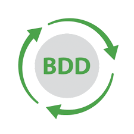

### BDD (Behavior Driven Development) - <kbd>Versão 1.0</kbd>  

BDD syntax for user stories.  

> BDD (*Behavior Driven Development*) ou **desenvolvimento orientado por comportamento** é uma técnica de desenvolvimento Ágil que
> encoraja colaboração entre desenvolvedores, setores de qualidade e pessoas não-técnicas ou de negócios num projeto de software e se
> relaciona com o conceito de verificação e validação.  
>  
> **Wikipedia**  

 

   
MIT License © [Luciana Muniz Freire](https://br.linkedin.com/in/lumunizf).
